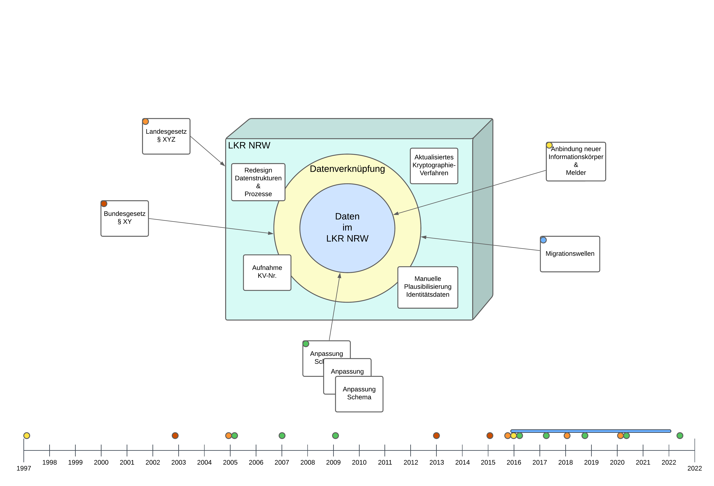

== Ziel der Masterarbeit

=== Ziel der Masterarbeit

[%step]
> Das Ziel dieser Masterarbeit ist zu untersuchen, ob zeitbedingte Veränderungen einen Effekt auf die im Record Linkage Verfahren verwendeten Korrekturfaktoren hatten und diese einen Einfluss auf die Genauigkeit und Effizienz des Verfahrens hatten oder immer noch haben.

'''

[%step]
> Das Ziel dieser Masterarbeit ist zu untersuchen, ob *zeitbedingte Veränderungen* einen *Effekt* auf die im *Record Linkage Verfahren verwendeten Korrekturfaktoren* hatten und diese einen *Einfluss auf die Genauigkeit und Effizienz* des Verfahrens *hatten oder* immer noch *haben*.

[.notes]
--
* Ein Satz meiner Arbeit fasst es gut zusammen
* Aber was heißt das jetzt eigentlich?
* Wichtigsten Punkte hervorgehoben
--

[.columns]
=== Das heißt?

[.notes]
--
* Viele unterschiedlichste Ereignisse über die Zeit
* Paar positiv von Innen heraus, einige unnötig negativ und führten zu mehr Komplexität
* Frage nach Einfluss, wurde sich nie gestellt
** Keine Möglichkeit / Zeit gehabt das zu betrachten und zu analysieren
--

[.columns]
=== Beitrag der Arbeit

[.column.is-half]
--
*Für das LKR NRW:*

[%step]
* Erstmalige retrospektive Betrachtung
[%step]
* Qualitätsentwicklung
[%step]
* Möglichkeiten der Optimierung
--

[%step]
[.column.is-half]
--
*Für die allgemeine Forschung:*
[%step]
* Generalisierbar
[%step]
* Höhere Genauigkeit -> besseres Vertrauen
--

[.notes]
--
* Beitrag der Arbeit:
** Für das LKR mehrere Vorteile
*** Erstmalige Betrachtung der Korrekturfaktoren in diesem Verfahren
*** Verlauf zeigt eine durchweg hohe Qualität in den Daten
*** Ableitung von Verbesserungspotenzialen
*** Zeigte Anomalien und Ausreißer

* Für die allgemeine Forschung:
** LKR stellt Daten für die onko. Forschung bereit -> Bessere Qualität = besseres Vertrauen
** Evaluationsansatz übertragbar auf weitere Register mit selben Verfahren
** Geringe Komplexität im Aufbau
--